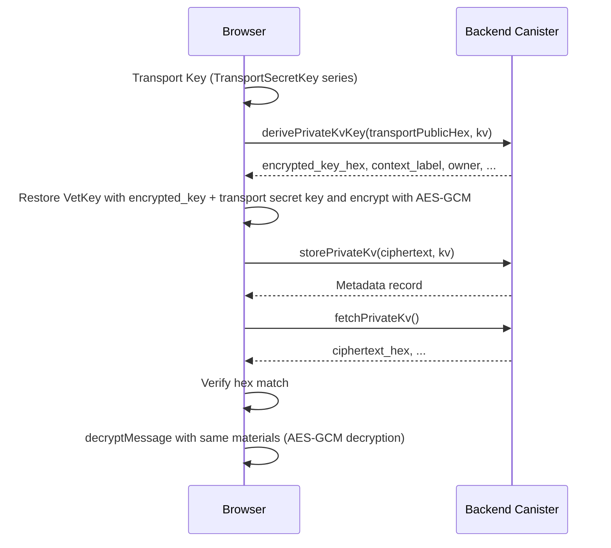

# vetKD Overview

vetKD is a mechanism for generating canister-specific public keys and deriving keys using the `vetkd_public_key` and `vetkd_derive_key` methods of the Management Canister.

## Key Points

- `vetkd_public_key` takes an `opt principal` for `canister_id`, `context`, and `key_id`, and returns a `public_key`.
- `vetkd_derive_key` takes `input`, `context`, `transport_public_key`, and `key_id`, and returns an `encrypted_key`.
- `vetkd_derive_key` requires cycles to be attached.
- Use `test_key_1` for local development and `key_1` for mainnet / testnet.
- It is safe to use a fixed value for `context` as an application domain separator.

---

## ICP vetKD API and Management Canister Call Structure

The backend canister implementing vetKD generates encrypted keys by calling low-level APIs provided by the **ICP Management Canister**. Below are the two core APIs used in the backend implementation of `PrivateKvRoundtrip.tsx` and the design policies for using them safely.

### Management Canister `vetkd_public_key`

```
Type: vetkd_public_key : (record { 
  canister_id : opt principal; 
  context : blob; 
  key_id : record { curve : variant { bls12_381_g2 }; name : text } 
}) -> (record { public_key : blob })
```

**Purpose**:  
Retrieves the **public key** for a given combination of context and key ID. This is used for verifying the `encrypted_key` that the client will later decrypt with their transport secret key, and as input for HKDF.

**Argument Responsibilities**:

| Parameter | Usage | Example | Notes |
|-----------|-------|---------|-------|
| `canister_id` | Specify null. Targets the caller canister | `null` | Always null in this branch |
| `context` | Fixed as an application domain separator. Include the caller principal if caller isolation is required | `UTF-8("private-kv-v1") ‖ caller.toCanonicalBlob()` | Determined by the backend canister. Not received from the client |
| `key_id.curve` | Specification of the BLS curve | `#bls12_381_g2` | Immutable |
| `key_id.name` | Key name (varies by environment) | `"key_1"` (mainnet), `"test_key_1"` (local test) | Changes with key rotation |

**Return Value**:

| Field | Content | Length | Usage |
|-----------|---------|--------|-------|
| `public_key` | Serialized form of a point in the BLS 12-381 G2 group | 96 bytes | Used by the client to verify `encrypted_key`. e.g., `VetKey.verifyIntegrity()` in `@dfinity/vetkeys` |

**Cycles Cost**:  
**0 cycles** (no attachment required).

**Security Note**:  
If multiple actors (principals) of the same canister use different `context`s, isolate them by including the caller principal in the context. Use a separate context for shared resources.

---

### Management Canister `vetkd_derive_key`

```
Type: vetkd_derive_key : (record {
  input : blob;
  context : blob;
  transport_public_key : blob;
  key_id : record { curve : variant { bls12_381_g2 }; name : text }
}) -> (record { encrypted_key : blob })
```

**Purpose**:  
Generates an encrypted key based on threshold secret sharing. Designed so that the client can decrypt it with their transport secret key without the canister ever seeing the secret.

**Argument Responsibilities**:

| Parameter | Usage | Example | Notes |
|-----------|-------|---------|-------|
| `input` | Label identifying the resource. The same `input` generates the same key | `UTF-8("kv:") ‖ resource_id_bytes ‖ UTF-8(":value-key:v1")` | Can be accepted from the client or generated on the backend from a resource ID. For key rotation, change the version (e.g., `v2`) to get a new secret |
| `context` | Same as `vetkd_public_key`. Application domain separator | Same as above | Must be consistent with `vetkd_public_key` |
| `transport_public_key` | Temporary ECDH public key (BLS 12-381 G1) generated by the client | 48 bytes | `TransportSecretKey.random()` → `.publicKeyBytes()` on the client browser side |
| `key_id.curve`, `key_id.name` | Same as above | Same as above | Same as above |

**Return Value**:

| Field | Content | Length | Usage |
|-----------|---------|--------|-------|
| `encrypted_key` | Encrypted byte sequence constructed by threshold secret sharing | 192 bytes | Decrypted by the client with `transport_secret_key` to obtain raw VetKey bytes. The plaintext secret never reaches the canister |

**Cycles Cost**:  
**Required**. The backend canister must attach sufficient cycles using **`ic0.call_cycles_add128`** when calling.

Official estimates (measurable on local replica):

- `test_key_1`: ≈ 10 billion cycles
- `key_1`: ≈ 26 billion cycles

In implementation, it is recommended to attempt dynamic estimation with `ic0.cost_vetkd_derive_encrypted_key(...)` and use a fallback with a 20% margin based on the above if it fails or returns 0 locally (see branch rules).

**Security Note**:  
1. The canister returns the `encrypted_key` as-is to the client. It only saves metadata (version / ACL) without plaintexting it.
2. The client can only decrypt with the returned `encrypted_key` and their own `transport_secret_key`.
3. The same caller + same `input` + same `context` returns the same `encrypted_key` (deterministic). This can be used for roundtrip verification and consistency in encryption/decryption.

---

### Cycles Handling within the Backend Canister

Attaching cycles is mandatory for `vetkd_derive_key`. The backend follows this flow:

1. **Capture caller principal at the beginning of the update function** (to avoid issues where the reader changes after an await).
2. **Construct `context`** (from caller principal and application name).
3. **Determine `input`** (from resource ID and version).
4. **Estimate cycles**:
   - Calculate with `ic0_cost_vetkd_derive_encrypted_key` for release builds with the flag enabled.
   - Fallback based on key name if 0 is returned locally.
5. **Prevent overflow**: Safely calculate with addCap / mulCap.
6. **Attach with `ic0.call_cycles_add128(0, estimatedCycles)`**.
7. **Call `vetkd_derive_key` of the Management Canister** (async callback).
8. **Return the resulting `encrypted_key` as-is to the client**.

---

### Division of Responsibilities between Backend and Client (Security Model)

| Item | Backend Canister | Client Browser |
|------|-------------------|-----------------|
| Verify caller principal | ✓ Reads caller and includes in context | ✗ (Browser trusts its own principal) |
| Determine context | ✓ Determined from domain separator + caller | ✗ Does not receive context |
| Generate input | △ From resource ID or from client (verify if from client) | △ Propose resource ID |
| Manage transport secret key | ✗ **Does not see** transport secret; only receives public key | ✓ Browser memory only; not sent to canister |
| Decrypt encrypted_key | ✗ Does not decrypt; only saves metadata | ✓ Decrypts with transport secret |
| Derive symmetric key (HKDF) | ✗ Does not perform | ✓ Performed from VetKey |
| Plaintext encryption/decryption | ✗ Does not perform | ✓ AES-256-GCM |
| ACL / Access Control | ✓ Verifies relationship between caller and resource | ✗ (Determined by canister) |

---

## Private KV Roundtrip (Flow of `PrivateKvRoundtrip.tsx`)

In `runRoundtrip` (approximately lines 58–164) of `examples/vetkey/frontend/app/src/components/PrivateKvRoundtrip.tsx`, plaintext encrypted with materials derived from vetKey is saved to and retrieved from a Private KV **for each caller (principal logged in via Internet Identity)**. Key generation, encryption, and decryption are performed in the browser, while the **sample backend canister** is only requested to retrieve key derivation results and store/fetch blobs.

The following **example** shows values that appeared in `console.log` during a single execution. Keys, principals, and ciphertexts **change with each execution**.

### Prerequisites (UI/Input)

- **key version**: The input string is converted to a `BigInt` referred to as `kv`. This value is passed as the second argument (`nat64`) to `derivePrivateKvKey` and `storePrivateKv`.  
  **Example**: `1` in the UI → `kv` is `1n`.
- **Plaintext**: Converted to a `Uint8Array` using `TextEncoder` before being passed to subsequent encryption processes.  
  **Example**: String `hello world` → Byte sequence hex is `68656c6c6f20776f726c64`.

### Step 0: Generation of Transport Key Material (No Canister Call)

At this stage, **no canister is called**. The browser side prepares strings and byte sequences to be passed to subsequent steps.

**0-1 (Library `@dfinity/vetkeys`)** `TransportSecretKey.random()`

- **Arguments**: None.
- **Return Value**: A temporary secret key object for transport (hereafter referred to as `transportSecret`).

**0-2 (Library)** `transportSecret.serialize()`

- **Arguments**: None.
- **Return Value**: `Uint8Array` of the secret key.

**0-3 (App)** Convert byte sequence to hex string

- **Input**: Byte sequence from 0-2.
- **Output**: `transportSecretHex` (held by the component until decryption; **not sent to the canister**).  
  **Example**: `5783ba99bebd52ddc5b571f7b9a614f4eca22bb15d72158531c65028101f62bc` (hex of a 32-byte secret key).

**0-4 (Library)** `transportSecret.publicKeyBytes()`

- **Arguments**: None.
- **Return Value**: `Uint8Array` of the transport public key.

**0-5 (App)** Convert byte sequence to hex string

- **Input**: Byte sequence from 0-4.
- **Output**: `transportPublicHex` (used only as the **first argument for the canister in Step 1**).  
  **Example**: `8260f5058e4f416ae81c72ab77e56cd0e5a957933217a7de253bf89375c3ff4839e7536ecba6bdc163b7e6ce85bc062f` (in this log example, the result of `trim().toLowerCase()` is the same string).

### Step 1: `derivePrivateKvKey` (Canister)

**Candid**: `derivePrivateKvKey : (text, nat64) -> (record { ... })`

**1 Canister Call**

- **1st Argument (`text`)**: `transportPublicHex` obtained in Step 0-5 (hex of the transport public key).  
- **2nd Argument (`nat64`)**: `kv` (key version).  

```
transportPublicHex: 8260f5058e4f416ae81c72ab77e56cd0e5a957933217a7de253bf89375c3ff4839e7536ecba6bdc163b7e6ce85bc062f
kv: 1n
```

**Main fields used in this roundtrip from the return value (record)**

| Field | Meaning |
|------------|------|
| `owner` | Principal of the KV owner (usually the caller) |
| `context_label` | Text representation of the context used for key derivation |
| `encrypted_key_hex` | Hex of the blob corresponding to `encrypted_key` from `vetkd_derive_key`. This becomes input for subsequent browser-side processing |

```
owner: krzlp-frl5q-f7xu4-4csnc-i5p7y-xuhti-si6hg-ulr7i-aafku-p4a6i-eqe
context_label: private-kv-v1|owner=krzlp-frl5q-f7xu4-4csnc-i5p7y-xuhti-si6hg-ulr7i-aafku-p4a6i-eqe
# Total is about 192 bytes = 384 hex characters
encrypted_key_hex: ADAC5DEB3BD35CF015CAB21C69F56A475EBBBA453EF2B0B3D8...083
```

The component verifies whether the string constructed from the constant `PRIVATE_KV_DOMAIN_SEP` (`"private-kv-v1"`) and `owner.toString()` matches **`context_label`**, and throws an exception if they do not match.

**Backend Implementation Behavior**

The backend implementation of `derivePrivateKvKey` (update function of the backend canister) performs the following processes:

1. **Capture caller principal** (equivalent to `msg_caller`).
   - Since an `await` occurs in subsequent steps, it is captured early.

2. **Construct input**
   - `input = UTF-8("kv:") ‖ caller.toCanonicalBlob() ‖ UTF-8(":value-key:v") ‖ key_version.toLEB128()`
   - Same caller + same key_version results in the same input → same encrypted_key.

3. **Construct context**
   - `context = UTF-8("private-kv-v1") ‖ caller.toCanonicalBlob()`
   - Guarantees isolation per caller.

4. **Parse transport_public_key**
   - Converts the hex received from the client back to a 48-byte sequence.

5. **Estimate cycles**
   - Attempts dynamic estimation with `ic0_cost_vetkd_derive_encrypted_key()`.
   - Fallback to 20% margin of `key_1` cost if it fails or returns 0 locally.

6. **Attach cycles with `ic0.call_cycles_add128()`**
   - Prepares necessary cycles for `vetkd_derive_key` call to the Management Canister.

7. **Call `vetkd_derive_key`** → **await**
   - Passes `input`, `context`, `transport_public_key`, and `key_id` to the Management Canister.
   - Management Canister returns `encrypted_key`.
   - **Canister side does not decrypt `encrypted_key`**. It does not see the plaintext secret.

8. **Return response to client**
   - Converts `encrypted_key` to hex and returns as `encrypted_key_hex`.
   - Also returns `context_label` (for debugging).
   - Also returns `owner` principal.

**Cycles Breakdown (Cost in this step)**

| Target | Cost |
|------|--------|
| `vetkd_derive_key` cycles add | ≈ 26B cycles (key_1) + 20% margin ≈ 31.2B cycles |
| Backend canister update processing (ICP standard cost) | ≈ 2-5M cycles |
| **Total** | ≈ 31.2B + several M cycles |

This cost is paid by the caller (assuming the backend canister has sufficient balance).

### Step 2: Encryption of Plaintext (No Canister Call)

At this stage, **no canister is called**. The inputs are (a) `transportSecretHex` from Step 0-3, (b) `encrypted_key_hex` from Step 1, (c) the `Uint8Array` of the plaintext prepared in the prerequisites, and (d) a string for domain separation (in this example, `"private-kv-v1"`).

```
transportSecretHex: 0e89f1ff375a4e16ceabf981e9e0613b09ad50b90dec589feb170598ea24275f
plaintextHex: 7573657220736563726574207061796c6f616420666f722070726976617465206b76
domainSep: private-kv-v1
```

**2-1 (App)** Convert hex string back to byte sequence

- **Input**: `transportSecretHex`.  
  **Example**: `0e89f1ff375a4e16ceabf981e9e0613b09ad50b90dec589feb170598ea24275f`.
- **Output**: Secret key byte sequence.

**2-2 (Library `@dfinity/vetkeys`)** `TransportSecretKey.deserialize(...)`

- **Arguments**: Byte sequence from 2-1.
- **Return Value**: A secret key object equivalent to `transportSecret`.

**2-3 (App)** Convert hex string back to byte sequence

- **Input**: `encrypted_key_hex` from Step 1.  
  **Example**: The long hex including the start and end shown in Step 1 (about 384 characters total).
- **Output**: `encrypted_key_bytes` (typically 192 bytes, with a layout of 48B start, 96B middle, and 48B end).

**2-4 (Library `@noble/curves`)** `bls12_381.G1.ProjectivePoint.fromHex` (twice)

- **Arguments**: The first 48 bytes and the **last 48 bytes** of `encrypted_key_bytes` (the middle 96 bytes are skipped).
- **Return Value**: Points `c1` and `c3` on the curve.

**2-5 (Library)** `transportSecret.serialize()` and `bls12_381.G1.normPrivateKeyToScalar(...)`

- **Input**: Serial byte sequence of the transport secret key.
- **Output**: Scalar `sk`.

**2-6 (Library `@noble/curves`)** Point `multiply` / `subtract`

- **Input**: `c1`, `c3`, `sk`.
- **Output**: Point `c3 - c1 * sk` (point for VetKey).

**2-7 (Library `@dfinity/vetkeys`)** Construct `VetKey`

- **Arguments**: Point from 2-6.
- **Return Value**: `VetKey` instance.

**2-8 (Library `@dfinity/vetkeys`)** `asDerivedKeyMaterial()` (`await`)

- **Arguments**: None (receiver is `VetKey` from 2-7).
- **Return Value**: An object that can carry the raw byte sequence of VetKey as IKM into Web Crypto's HKDF.

**2-9 (Library `@dfinity/vetkeys` + Web Crypto)** `encryptMessage(plaintext, domainSep)`

- **Arguments**: `Uint8Array` of the plaintext, domain separation string `domainSep` (in this example, `"private-kv-v1"`). The UTF-8 of `domainSep` is used as **HKDF `info`**, and is **not AES-GCM AAD** (conforming to the `@dfinity/vetkeys` 0.4.x implementation).
- **Return Value**: A single `Uint8Array` consisting of **`IV (12 bytes) ‖ AES-256-GCM ciphertext and authentication tag`**.  
  **Example**: `Uint8Array` of length 62, hex is `63f402c2dd2b99290765c8b7eafb2a2f254c87b8475ac46ccca6aa0d1a90c7b4499e5b2c7ca08d990cd5c60b3fe86477620caccdfaa7cd937e39d3ef6435` (12 + 34 + 16 bytes).

**2-10 (App)** Convert ciphertext byte sequence to hex string

- **Input**: `Uint8Array` from 2-9.  
  **Example**: `63f402c2dd2b99290765c8b7eafb2a2f254c87b8475ac46ccca6aa0d1a90c7b4499e5b2c7ca08d990cd5c60b3fe86477620caccdfaa7cd937e39d3ef6435`.
- **Output**: Hex for subsequent display and comparison (passed to `storePrivateKv` **as a byte sequence**).

### Step 3: `storePrivateKv` (Canister)

**Candid**: `storePrivateKv : (blob, nat64) -> (record { ... })`

**1 Canister Call**

- **1st Argument (`blob`)**: Ciphertext byte sequence obtained in Step 2-9.  
  **Example**: `Uint8Array` with the same content as the 62 bytes in Step 2-9.
- **2nd Argument (`nat64`)**: `kv`.  
  **Example**: `1n`.

**Return Value**: Record of metadata (in this minimal roundtrip, it mainly serves to confirm that "saving was successful").

**Backend Implementation Behavior**

The backend implementation of `storePrivateKv` performs the following processes:

1. **Capture caller principal** (at the beginning of the update function).
2. **Receive ciphertext blob** (created by the client, type `blob`).
3. **Receive key_version** (specified by the client, type `nat64`).
4. **Save to internal canister storage**
   - Key: Combination of `(caller_principal, key_version)`.
   - Value: `{ ciphertext: blob, owner: principal, key_version: nat64, ...metadata }`.
5. **Return response** (success notification).

Notes:
- The canister **does not decrypt** the ciphertext. It saves it as a blob.
- ACL or ownership checks are not required at this point (assuming the caller is a legitimate principal).
- Cycles cost: Canister store operation (ICP standard cost, several M cycles).

### Step 4: `fetchPrivateKv` (Canister)

**Candid**: `fetchPrivateKv : () -> (record { ciphertext_hex: text; key_version: nat; owner: principal; })`

**1 Canister Call**

- **Arguments**: None (reads the caller's KV).

**Return Value**

- **`ciphertext_hex`**: Hex string of the stored ciphertext.  
  **Example**: `63F402C2DD2B99290765C8B7EAFB2A2F254C87B8475AC46CCC…08D990CD5C60B3FE86477620CACCDFAA7CD937E39D3EF6435` (example returned with mixed case).
- Others: `key_version`, `owner`.

The component compares the fetched hex normalized to lowercase with the lowercase version of the hex obtained in Step 2-10, and throws an exception if they do not match.  
**Example**: `fetchedCiphertextHexLower` is `63f402c2dd2b99290765c8b7eafb2a2f254c87b8475ac46ccca6aa0d1a90c7b4499e5b2c7ca08d990cd5c60b3fe86477620caccdfaa7cd937e39d3ef6435`, which matches the hex (lowercase) from Step 2-10.

**Backend Implementation Behavior**

The backend implementation of `fetchPrivateKv` performs the following processes:

1. **Capture caller principal** (at the beginning of the query/update function).
2. **Read from canister storage** with key `(caller_principal, latest key_version)` (or version specified by argument).
   - Returns error or empty response if not found.

3. **Retrieve ciphertext and metadata**
   - `{ ciphertext_hex: text, owner: principal, key_version: nat64, ... }`.
   - Converts ciphertext to hex and returns it.

4. **Return response**

Notes:
- `fetchPrivateKv()` appears to be a **query without arguments** in this sample (no arguments from the component side), but the backend canister implementation implicitly captures the caller and returns the caller's latest KV.
- If you want to read an older version, a design like `fetchPrivateKvByVersion(key_version: nat64)` could be added.
- Cycles cost: Canister read operation (0 if query, standard cost if update).

### Step 5: Decryption (No Canister Call)

**No canister is called**. The inputs are (a) `transportSecretHex` from Step 0-3, (b) `encrypted_key_hex` from Step 1, (c) the byte sequence converted from `ciphertext_hex` in Step 4, and (d) the same `domainSep` as in Step 2.

**Example**: `transportSecretHex` is `0e89f1ff375a4e16ceabf981e9e0613b09ad50b90dec589feb170598ea24275f`, `ciphertext_hex` is the byte sequence from the uppercase hex in Step 4, and `domainSep` is `private-kv-v1`.

**5-1 to 5-8**  
Following the same order as Steps **2-1 to 2-8**, the same `transportSecretHex` and `encrypted_key_hex` lead to the same type of object (containing HKDF IKM) as in Step 2-8.

**5-9 (Library `@dfinity/vetkeys` + Web Crypto)** `decryptMessage(ciphertext, domainSep)`

- **Arguments**: Ciphertext byte sequence obtained in Step 4 (interpreting the first 12 bytes as IV and the rest as GCM body + tag), `domainSep`.
- **Return Value**: `Uint8Array` of the plaintext.  
  **Example (Log)**: `decryptedBytesHex` is `7573657220736563726574207061796c6f616420666f722070726976617465206b76` (matches `plaintextHex` before encryption), length 34 bytes.

**5-10 (Standard Browser)** `TextDecoder`

- **Input**: Byte sequence from 5-9.
- **Output**: UTF-8 string. The component compares this with the input plaintext.  
  **Example (Log)**: `decryptedBytesUtf8` is `user secret payload for private kv`.

---

### Key Points of Symmetric Encryption (Inside `encryptMessage` / `decryptMessage` in the library)

| Item | Content |
|------|---------|
| IKM | Raw byte sequence of VetKey (corresponding to 48 bytes of BLS representation) |
| Key Derivation | HKDF (SHA-256), empty salt, `info` = UTF-8 of `domainSep`, AES-256-GCM 256 bit |
| Format | Ciphertext is **12-byte IV + GCM output (including tag)** |

### Process Flow (Summary Diagram)



---

## Big Picture of Management Canister Calls

In the Private KV roundtrip, **calls to the Management Canister occur only in Step 1**.

| Step | Backend Call | Management Canister Call | Remarks |
|---------|----------------|----------------------------|------|
| 0 | ✗ | ✗ | Browser only, transport key generation |
| 1: `derivePrivateKvKey` | ✓ (update) | ✓ `vetkd_derive_key` + cycles add | **Only in this step** |
| 2 | ✗ | ✗ | Browser only, encryption |
| 3: `storePrivateKv` | ✓ (update) | ✗ | Only saving the blob |
| 4: `fetchPrivateKv` | ✓ (query/update) | ✗ | Only reading the blob |
| 5 | ✗ | ✗ | Browser only, decryption |

**Important**: The backend canister is responsible for calling `vetkd_derive_key` of the Management Canister, attaching cycles, and processing the response. The client browser does not communicate directly with the Management Canister.

## References

- [Management Canister / vetKD](https://docs.internetcomputer.org/references/management-canister#vetkd-verifiable-encrypted-threshold-key-derivation)
- [@dfinity/vetkeys (npm)](https://www.npmjs.com/package/@dfinity/vetkeys)
