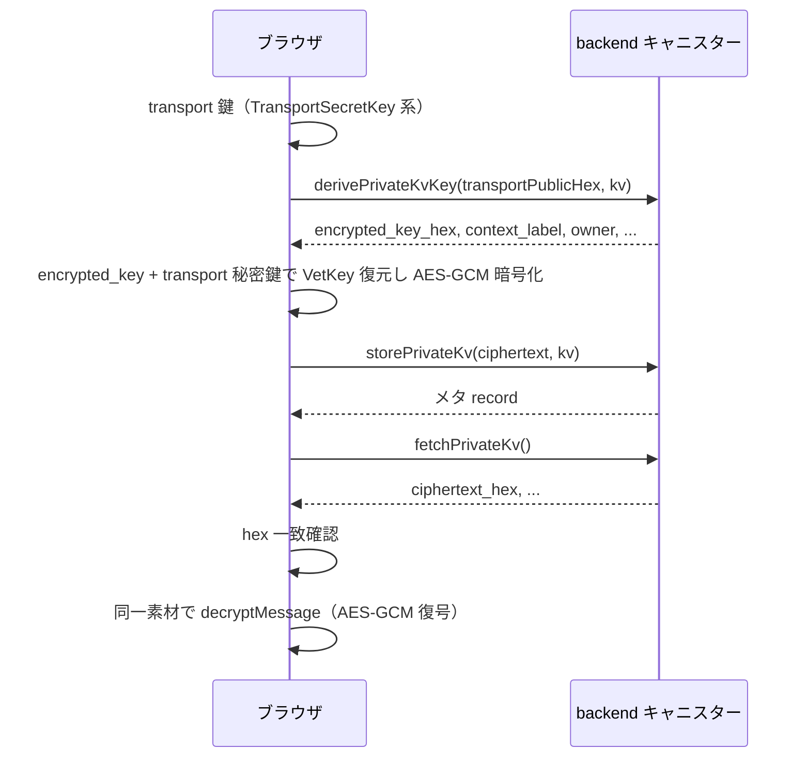

# vetKD 概要

vetKD は Management Canister の `vetkd_public_key` と `vetkd_derive_key` を使って、キャニスターごとの公開鍵生成と鍵導出を行う仕組みです。

## 要点

- `vetkd_public_key` は `opt principal` の `canister_id`、`context`、`key_id` を受け取り、`public_key` を返します。
- `vetkd_derive_key` は `input`、`context`、`transport_public_key`、`key_id` を受け取り、`encrypted_key` を返します。
- `vetkd_derive_key` には cycles の添付が必要です。
- ローカル開発では `test_key_1`、mainnet / testnet では `key_1` を使います。
- `context` はアプリケーションの domain separator として固定値を使うのが安全です。

---

## ICP の vetKD API と Management Canister 呼び出しの体系

vetKD を実装する backend キャニスターは、**ICP の Management Canister** が提供する低レベル API を呼び出して、暗号化された鍵を生成します。以下は、`PrivateKvRoundtrip.tsx` のバックエンド実装で使われる 2 つの Core API と、それらを安全に利用するための設計方針をまとめたものです。

### Management Canister の vetkd_public_key

```
型: vetkd_public_key : (record { 
  canister_id : opt principal; 
  context : blob; 
  key_id : record { curve : variant { bls12_381_g2 }; name : text } 
}) -> (record { public_key : blob })
```

**目的**：  
与えられた context と key ID の組み合わせに対する **公開鍵** を取得します。後に client が transport 秘密鍵で復号する `encrypted_key` の検証や HKDF の入力に使用されます。

**引数の責務**：

| パラメータ | 用途 | 例 | 注記 |
|-----------|------|-----|------|
| `canister_id` | null を指定。caller canister が対象 | `null` | 本ブランチでは常に null |
| `context` | application domain separator として固定。caller 分離がある場合は caller principal を含める | `UTF-8("private-kv-v1") ‖ caller.toCanonicalBlob()` | backend canister で決定。client からは受け取らない |
| `key_id.curve` | BLS 曲線の指定 | `#bls12_381_g2` | 不変 |
| `key_id.name` | 鍵名（環境に応じて異なる） | `"key_1"`（mainnet）、`"test_key_1"`（ローカルテスト） | 鍵ローテーションで変わる |

**返り値**：

| フィールド | 内容 | 長さ | 用途 |
|-----------|------|------|------|
| `public_key` | BLS 12-381 G2 群の点の serialize 形式 | 96 bytes | client が `encrypted_key` の検証に使う。`@dfinity/vetkeys` の `VetKey.verifyIntegrity()` など |

**cycles コスト**：  
**0 cycles**（添付不要）。

**セキュリティ注釈**：  
同じ canister の複数の actor（principal）が異なる `context` を使う場合、context に caller principal を含めて分離。共有リソースは別 context にする。

---

### Management Canister の vetkd_derive_key

```
型: vetkd_derive_key : (record {
  input : blob;
  context : blob;
  transport_public_key : blob;
  key_id : record { curve : variant { bls12_381_g2 }; name : text }
}) -> (record { encrypted_key : blob })
```

**目的**：  
threshold secret sharing に基づく暗号化された鍵を生成します。canister が secret を見ることなく、client が transport 秘密鍵で復号できる設計です。

**引数の責務**：

| パラメータ | 用途 | 例 | 注記 |
|-----------|------|-----|------|
| `input` | リソースを識別するラベル。同じ `input` は同じ鍵を生成 | `UTF-8("kv:") ‖ resource_id_bytes ‖ UTF-8(":value-key:v1")` | client が生成した値を受け入れても、またはリソース ID から backend で生成しても可能。鍵ローテーションは `v2` など version を変えて new secret にする |
| `context` | `vetkd_public_key` と同じ。application domain separator | 同上 | `vetkd_public_key` と一貫性が必須 |
| `transport_public_key` | client が生成した一時的な ECDH 公開鍵（BLS 12-381 G1） | 48 bytes | client のブラウザ側で `TransportSecretKey.random()` → `.publicKeyBytes()` |
| `key_id.curve`, `key_id.name` | 同上 | 同上 | 同上 |

**返り値**：

| フィールド | 内容 | 長さ | 用途 |
|-----------|------|------|------|
| `encrypted_key` | threshold secret sharing によって構成された暗号化バイト列 | 192 bytes | client が `transport_secret_key` で復号し、VetKey の raw bytes を得る。平文 secret は canister に到達しない |

**cycles コスト**：  
**必須**。backend canister は呼び出し時に **`ic0.call_cycles_add128` で十分な cycles を添付する必要があります**。

公式の推定値（ローカル replica で計測可能）：

- `test_key_1`: ≈ 10 billion cycles
- `key_1`: ≈ 26 billion cycles

実装では `ic0.cost_vetkd_derive_encrypted_key(...)` で動的推定を試み、失敗またはローカルで 0 が返る場合は上記を基準に 20% margin を加える fallback を用いるのが推奨です（ブランチルール参照）。

**セキュリティ注釈**：  
1. canister は `encrypted_key` をそのまま client に返す。平文化せず、metadata（version / ACL）だけ保存する。
2. client は返された `encrypted_key` と自分の `transport_secret_key` でのみ復号できる。
3. 同一 caller + 同一 `input` + 同一 `context` は同一 `encrypted_key` を返す（決定性）。これは往復確認や暗号化・復号の consistency に活用できる。

---

### backend キャニスター内での cycles 処理

`vetkd_derive_key` は cycles 添付が必須です。backend は以下の流れで対応します：

1. **update 関数の冒頭で caller principal を捕捉**（await 後に reader が変わる事故を避ける）
2. **`context` 構築**（caller principal と application name から）
3. **`input` 決定**（リソース ID と version から）
4. **cycles 推定**：
   - release build かつ flag 有効時、`ic0_cost_vetkd_derive_encrypted_key` で計算
   - ローカルで 0 が返る場合、鍵名に応じた fallback
5. **オーバーフロー防止**：addCap / mulCap で安全に計算
6. **`ic0.call_cycles_add128(0, estimatedCycles)` で添付**
7. **Management Canister の `vetkd_derive_key` 呼び出し**（async callback）
8. **戻り値の `encrypted_key` をそのまま client に返す**

---

### backend 側と client 側の責務分担（セキュリティモデル）

| 項目 | backend キャニスター | client ブラウザ |
|------|-------------------|-----------------|
| caller principal の確認 | ✓ caller を読み、context に含める | ✗ （ブラウザは自分の principal を信頼） |
| context の決定 | ✓ domain separator + caller から決定 | ✗ context を受け取らない |
| input の生成 | △ リソース ID から生成 or client から受け取り（受け取り時は検証） | △ リソース ID の提案 |
| transport 秘密鍵の管理 | ✗ transport secret は**見ない**、public key だけ受け取る | ✓ browser memory のみ、canister には送らない |
| encrypted_key の復号 | ✗ 復号しない、metadata だけ保存 | ✓ transport secret で復号 |
| 対称鍵の導出（HKDF） | ✗ 行わない | ✓ VetKey からのに実施 |
| 平文の暗号化・復号 | ✗ 行わない | ✓ AES-256-GCM |
| ACL・アクセス制御 | ✓ caller と resource の関係を検証 | ✗ （canister が決定） |

---

## Private KV ラウンドトリップ（`PrivateKvRoundtrip.tsx` の流れ）

`examples/vetkey/frontend/app/src/components/PrivateKvRoundtrip.tsx` の `runRoundtrip`（おおよそ 58〜164 行）では、**caller（Internet Identity でログインしたプリンシパル）ごと**の Private KV に、vetKey 由来の素材で暗号化した平文を保存し、取り出して復号します。鍵生成と暗号化・復号はブラウザ上で行い、**サンプル backend キャニスター**には鍵導出結果の取得と blob の保存・取得だけを依頼します。

以下の **一例** は同じ実行の `console.log` に現れた値である。鍵・プリンシパル・暗号文は**実行ごとに変わる**。

### 事前条件（UI・入力）

- **key version**: 入力文字列を `BigInt` にし `kv` とする。`derivePrivateKvKey`・`storePrivateKv` の第 2 引数（`nat64`）に相当する値として渡る。  
  **一例**: UI で `1` → `kv` は `1n`。
- **平文**: `TextEncoder` で UTF-8 の `Uint8Array` にしてから、以降の暗号化処理に渡る。  
  **一例**: 文字列 `hello world` → バイト列の hex は `68656c6c6f20776f726c64`。

### ステップ 0: transport 鍵素材の生成（キャニスター呼び出しなし）

この段階では **キャニスターは呼ばない**。ブラウザ側のみで、以降のステップに渡す文字列・バイト列を用意する。

**0-1（ライブラリ `@dfinity/vetkeys`）** `TransportSecretKey.random()`

- **引数**: なし。
- **返り値**: transport 用の一時秘密鍵オブジェクト（以下 `transportSecret` と書く）。

**0-2（ライブラリ）** `transportSecret.serialize()`

- **引数**: なし。
- **返り値**: 秘密鍵の `Uint8Array`。

**0-3（アプリ）** バイト列を hex 文字列に変換

- **入力**: 0-2 のバイト列。
- **出力**: `transportSecretHex`（以降の復号までコンポーネントが保持。**キャニスターには送らない**）。  
  **一例**: `5783ba99bebd52ddc5b571f7b9a614f4eca22bb15d72158531c65028101f62bc`（32 バイト秘密鍵の hex）。

**0-4（ライブラリ）** `transportSecret.publicKeyBytes()`

- **引数**: なし。
- **返り値**: transport 公開鍵の `Uint8Array`。

**0-5（アプリ）** バイト列を hex 文字列に変換

- **入力**: 0-4 のバイト列。
- **出力**: `transportPublicHex`（**ステップ 1 のキャニスター第 1 引数**にだけ使う）。  
  **実例**: `8260f5058e4f416ae81c72ab77e56cd0e5a957933217a7de253bf89375c3ff4839e7536ecba6bdc163b7e6ce85bc062f`（このログ例では `trim().toLowerCase()` の結果も同じ文字列）。

### ステップ 1: `derivePrivateKvKey`（キャニスター）

**Candid**: `derivePrivateKvKey : (text, nat64) -> (record { ... })`

**キャニスター呼び出し 1 回**

- **第 1 引数（`text`）**: ステップ 0-5 で得た `transportPublicHex`（transport 公開鍵の hex）。  
- **第 2 引数（`nat64`）**: `kv`（key version）。  

```
transportPublicHex: 8260f5058e4f416ae81c72ab77e56cd0e5a957933217a7de253bf89375c3ff4839e7536ecba6bdc163b7e6ce85bc062f
kv: 1n
```

**返り値（record）のうち、この往復で使う主なフィールド**

| フィールド | 意味 |
|------------|------|
| `owner` | KV の所有者プリンシパル（通常 caller） |
| `context_label` | 鍵導出に使った文脈のテキスト表現 |
| `encrypted_key_hex` | `vetkd_derive_key` の `encrypted_key` に相当する blob の hex。以降のブラウザ側処理の入力になる |

```
owner: krzlp-frl5q-f7xu4-4csnc-i5p7y-xuhti-si6hg-ulr7i-aafku-p4a6i-eqe
context_label: private-kv-v1|owner=krzlp-frl5q-f7xu4-4csnc-i5p7y-xuhti-si6hg-ulr7i-aafku-p4a6i-eqe
# 全体は 192 バイト＝384 hex 文字程度になる
encrypted_key_hex: ADAC5DEB3BD35CF015CAB21C69F56A475EBBBA453EF2B0B3D8...083
```

コンポーネントでは、定数 `PRIVATE_KV_DOMAIN_SEP`（`"private-kv-v1"`）と `owner.toString()` から組み立てた文字列と **`context_label` が一致するか**を検証し、一致しなければ例外にする。

**backend 実装上の動作**

`derivePrivateKvKey` の backend 実装（backend canister の update 関数）は、以下の処理を行います：

1. **caller principal を捕捉**（`msg_caller` 相当）
   - 以降のステップで `await` が入るため、上昇に進める

2. **input を構築**
   - `input = UTF-8("kv:") ‖ caller.toCanonicalBlob() ‖ UTF-8(":value-key:v") ‖ key_version.toLEB128()`
   - 同一 caller + 同一 key_version なら、同一 input → 同一 encrypted_key になる

3. **context を構築**
   - `context = UTF-8("private-kv-v1") ‖ caller.toCanonicalBlob()`
   - caller ごとの分離を保証

4. **transport_public_key をパース**
   - client から受け取った hex を 48 バイト のバイト列に戻す

5. **cycles 推定**
   - `ic0_cost_vetkd_derive_encrypted_key()` で動的推定を試す
   - 失敗時またはローカルで 0 が返る場合、`key_1` コストの 20% margin に fallback

6. **ic0.call_cycles_add128() で cycles を添付**
   - Management Canister への呼び出しに `vetkd_derive_key` 用に必要な cycles を準備

7. **vetkd_derive_key 呼び出し** → **await**
   - Management Canister に `input`, `context`, `transport_public_key`, `key_id` を渡す
   - Management Canister が `encrypted_key` を返す
   - **canister 側は `encrypted_key` を復号しない**。平文 secret を見ない。

8. **応答を client に返す**
   - `encrypted_key` を hex に変換して `encrypted_key_hex` として返す
   - `context_label`（debug 用）も返す
   - `owner` principal も返す

**cycles の内訳（本ステップでのコスト）**

| 対象 | コスト |
|------|--------|
| `vetkd_derive_key` の cycles add | ≈ 26B cycles（key_1）+ 20% margin ≈ 31.2B cycles |
| backend canister の update 処理本体（ICP 標準コスト） | ≈ 2-5M cycles |
| **合計** | ≈ 31.2B + 数M cycles |

このコストは caller が支払う（backend canister に充分な canister balance がある前提）。

### ステップ 2: 平文の暗号化（キャニスター呼び出しなし）

この段階でも **キャニスターは呼ばない**。入力は、(a) ステップ 0-3 の `transportSecretHex`、(b) ステップ 1 の `encrypted_key_hex`、(c) 事前条件で用意した平文の `Uint8Array`、`(d)` ドメイン分離用の文字列（この例では `"private-kv-v1"`）である。

```
transportSecretHex: 0e89f1ff375a4e16ceabf981e9e0613b09ad50b90dec589feb170598ea24275f
plaintextHex: 7573657220736563726574207061796c6f616420666f722070726976617465206b76
domainSep: private-kv-v1
```

**2-1（アプリ）** hex 文字列をバイト列に戻す

- **入力**: `transportSecretHex`。  
  **実例**: `0e89f1ff375a4e16ceabf981e9e0613b09ad50b90dec589feb170598ea24275f`。
- **出力**: 秘密鍵バイト列。

**2-2（ライブラリ `@dfinity/vetkeys`）** `TransportSecretKey.deserialize(...)`

- **引数**: 2-1 のバイト列。
- **返り値**: `transportSecret` と同等の秘密鍵オブジェクト。

**2-3（アプリ）** hex 文字列をバイト列に戻す

- **入力**: ステップ 1 の `encrypted_key_hex`。  
  **一例**: ステップ 1 で示した先頭・末尾を含む長い hex（全体で約 384 文字）。
- **出力**: `encrypted_key_bytes`（典型的には 192 バイト。先頭 48B・中間 96B・末尾 48B のレイアウト）。

**2-4（ライブラリ `@noble/curves`）** `bls12_381.G1.ProjectivePoint.fromHex`（2 回）

- **引数**: `encrypted_key_bytes` の先頭 48 バイト、および **末尾 48 バイト**（中間 96 バイトは読み飛ばす）。
- **返り値**: 曲線上の点 `c1` と `c3`。

**2-5（ライブラリ）** `transportSecret.serialize()` と `bls12_381.G1.normPrivateKeyToScalar(...)`

- **入力**: transport 秘密鍵のシリアルバイト列。
- **出力**: スカラー `sk`。

**2-6（ライブラリ `@noble/curves`）** 点の `multiply` / `subtract`

- **入力**: `c1`, `c3`, `sk`。
- **出力**: 点 `c3 - c1 * sk`（VetKey 用の点）。

**2-7（ライブラリ `@dfinity/vetkeys`）** `VetKey` の構築

- **引数**: 2-6 の点。
- **返り値**: `VetKey` インスタンス。

**2-8（ライブラリ `@dfinity/vetkeys`）** `asDerivedKeyMaterial()`（`await`）

- **引数**: なし（レシーバは 2-7 の `VetKey`）。
- **返り値**: VetKey の生バイト列を IKM として Web Crypto の HKDF に載せられるオブジェクト。

**2-9（ライブラリ `@dfinity/vetkeys` + Web Crypto）** `encryptMessage(plaintext, domainSep)`

- **引数**: 平文の `Uint8Array`、ドメイン分離文字列 `domainSep`（この例では `"private-kv-v1"`）。`domainSep` の UTF-8 は **HKDF の `info`** として使われ、**AES-GCM の AAD ではない**（`@dfinity/vetkeys` 0.4.x 系の実装に準拠）。
- **返り値**: **`IV（12 バイト）‖ AES-256-GCM の ciphertext と認証タグ`** からなる単一の `Uint8Array`。  
  **実例**: 長さ 62 の `Uint8Array`、hex は `63f402c2dd2b99290765c8b7eafb2a2f254c87b8475ac46ccca6aa0d1a90c7b4499e5b2c7ca08d990cd5c60b3fe86477620caccdfaa7cd937e39d3ef6435`（12 + 34 + 16 バイト）。

**2-10（アプリ）** 暗号文バイト列を hex 文字列に変換

- **入力**: 2-9 の `Uint8Array`。  
  **実例**: `63f402c2dd2b99290765c8b7eafb2a2f254c87b8475ac46ccca6aa0d1a90c7b4499e5b2c7ca08d990cd5c60b3fe86477620caccdfaa7cd937e39d3ef6435`。
- **出力**: 以降の表示・比較用の hex（`storePrivateKv` には **バイト列のまま**渡す）。

### ステップ 3: `storePrivateKv`（キャニスター）

**Candid**: `storePrivateKv : (blob, nat64) -> (record { ... })`

**キャニスター呼び出し 1 回**

- **第 1 引数（`blob`）**: ステップ 2-9 で得た暗号文バイト列。  
  **実例**: ステップ 2-9 の 62 バイトと同じ内容の `Uint8Array`。
- **第 2 引数（`nat64`）**: `kv`。  
  **実例**: `1n`。

**返り値**: メタ情報の record（この最小往復では主に「保存が通った」ことの確認に留まる）。

**backend 実装上の動作**

`storePrivateKv` の backend 実装は、以下の処理を行います：

1. **caller principal を捕捉**（update 関数冒頭で）
2. **暗号文 blob を受け取る**（client が作成したもの、`blob` 型）
3. **key_version を受け取る**（client が指定したもの、`nat64` 型）
4. **canister の内部ストレージに保存**
   - キー: `(caller_principal, key_version)` の組み合わせ
   - 値: `{ ciphertext: blob, owner: principal, key_version: nat64, ...metadata }`
5. **応答を返す**（成功通知）

注釈：
- canister は暗号文を **復号しない**。blob のまま保存する。
- ACL や所有権チェックはこの時点で不要（前提は caller が正当なプリンシパル）。
- cycles コスト: canister の store 操作（ICP 標準コスト、数M cycles）。

### ステップ 4: `fetchPrivateKv`（キャニスター）

**Candid**: `fetchPrivateKv : () -> (record { ciphertext_hex: text; key_version: nat; owner: principal; })`

**キャニスター呼び出し 1 回**

- **引数**: なし（caller の KV を読む）。

**返り値**

- **`ciphertext_hex`**: 保存されていた暗号文の hex 文字列。  
  **実例**: `63F402C2DD2B99290765C8B7EAFB2A2F254C87B8475AC46CCC…08D990CD5C60B3FE86477620CACCDFAA7CD937E39D3EF6435`（大文字混在で返る例）。
- その他 `key_version`, `owner`。

コンポーネントでは、フェッチした hex を小文字に正規化したものと、ステップ 2-10 で得た hex の小文字化とを比較し、一致しなければ例外にする。  
**実例**: `fetchedCiphertextHexLower` は `63f402c2dd2b99290765c8b7eafb2a2f254c87b8475ac46ccca6aa0d1a90c7b4499e5b2c7ca08d990cd5c60b3fe86477620caccdfaa7cd937e39d3ef6435` で、ステップ 2-10 の hex（小文字）と一致する。

**backend 実装上の動作**

`fetchPrivateKv` の backend 実装は、以下の処理を行います：

1. **caller principal を捕捉**（query/update 関数冒頭で）
2. **キー `(caller_principal, 最新の key_version)`（または引数で指定された version）で canister ストレージから読み込み**
   - 見つからない場合はエラーまたは空応答

3. **暗号文と metadata を取り出す**
   - `{ ciphertext_hex: text, owner: principal, key_version: nat64, ... }`
   - 暗号文を hex に変換して返す

4. **応答を返す**

注釈：
- `fetchPrivateKv()` はこのサンプルでは **引数がない query** に見える（コンポーネント側から呼び出しの引数なし）が、backend canister の実装では caller を暗黙に捕捉し、caller の最新 KV を返す仕様。
- もし古いバージョンを読みたい場合は、`fetchPrivateKvByVersion(key_version: nat64)` など明示的な version 指定 query を追加する設計もある。
- cycles コスト: canister の read 操作（query なら 0、update なら標準コスト）。

### ステップ 5: 復号（キャニスター呼び出しなし）

**キャニスターは呼ばない**。入力は、(a) ステップ 0-3 の `transportSecretHex`、(b) ステップ 1 の `encrypted_key_hex`、(c) ステップ 4 の `ciphertext_hex` をバイト列に戻したもの、(d) ステップ 2 と同じ `domainSep` である。

**一例**: `transportSecretHex` は `0e89f1ff375a4e16ceabf981e9e0613b09ad50b90dec589feb170598ea24275f`、`ciphertext_hex` はステップ 4 の大文字 hex をバイト列に戻したもの、`domainSep` は `private-kv-v1`。

**5-1 〜 5-8**  
ステップ **2-1 〜 2-8** と同じ順で、同じ `transportSecretHex` と `encrypted_key_hex` から、ステップ 2-8 と同種のオブジェクト（HKDF 用 IKM を内包）まで到達する。

**5-9（ライブラリ `@dfinity/vetkeys` + Web Crypto）** `decryptMessage(ciphertext, domainSep)`

- **引数**: ステップ 4 で得た暗号文バイト列（先頭 12 バイトを IV、残りを GCM の本体＋タグとして解釈）、`domainSep`。
- **返り値**: 平文の `Uint8Array`。  
  **実例（ログ）**: `decryptedBytesHex` は `7573657220736563726574207061796c6f616420666f722070726976617465206b76`（暗号化前の `plaintextHex` と一致）、長さ 34 バイト。

**5-10（ブラウザ標準）** `TextDecoder`

- **入力**: 5-9 のバイト列。
- **出力**: UTF-8 文字列。コンポーネントはこれを入力平文と比較する。  
  **実例（ログ）**: `decryptedBytesUtf8` は `user secret payload for private kv`。

### 対称暗号の要点（ライブラリ内の `encryptMessage` / `decryptMessage`）

| 項目 | 内容 |
|------|------|
| IKM | VetKey の生バイト列（BLS 上の表現の 48 バイトに相当） |
| 鍵導出 | HKDF（SHA-256）、salt 空、`info` = `domainSep` の UTF-8、AES-256-GCM 256 bit |
| 形式 | 暗号文は **12 バイト IV + GCM 出力（タグ含む）** |

### 処理の流れ（要約図）



---

## Management Canister 呼び出しの大局観

Private KV の往復では、**Management Canister への呼び出しはステップ 1 でのみ発生**します。

| ステップ | backend 呼び出し | Management Canister 呼び出し | 備考 |
|---------|----------------|----------------------------|------|
| 0 | ✗ | ✗ | ブラウザのみ、transport 鍵生成 |
| 1: `derivePrivateKvKey` | ✓ (update) | ✓ `vetkd_derive_key` + cycles add | **このステップでのみ** |
| 2 | ✗ | ✗ | ブラウザのみ、暗号化 |
| 3: `storePrivateKv` | ✓ (update) | ✗ | blob を保存するのみ |
| 4: `fetchPrivateKv` | ✓ (query/update) | ✗ | blob を読むのみ |
| 5 | ✗ | ✗ | ブラウザのみ、復号 |

**重要**：Management Canister への `vetkd_derive_key` の呼び出し・cycles 添付・レスポンス処理はすべて backend canister が担当します。client ブラウザは Management Canister と直接通信しません。

## 参考

- [Management Canister / vetKD](https://docs.internetcomputer.org/references/management-canister#vetkd-verifiable-encrypted-threshold-key-derivation)
- [@dfinity/vetkeys（npm）](https://www.npmjs.com/package/@dfinity/vetkeys)
