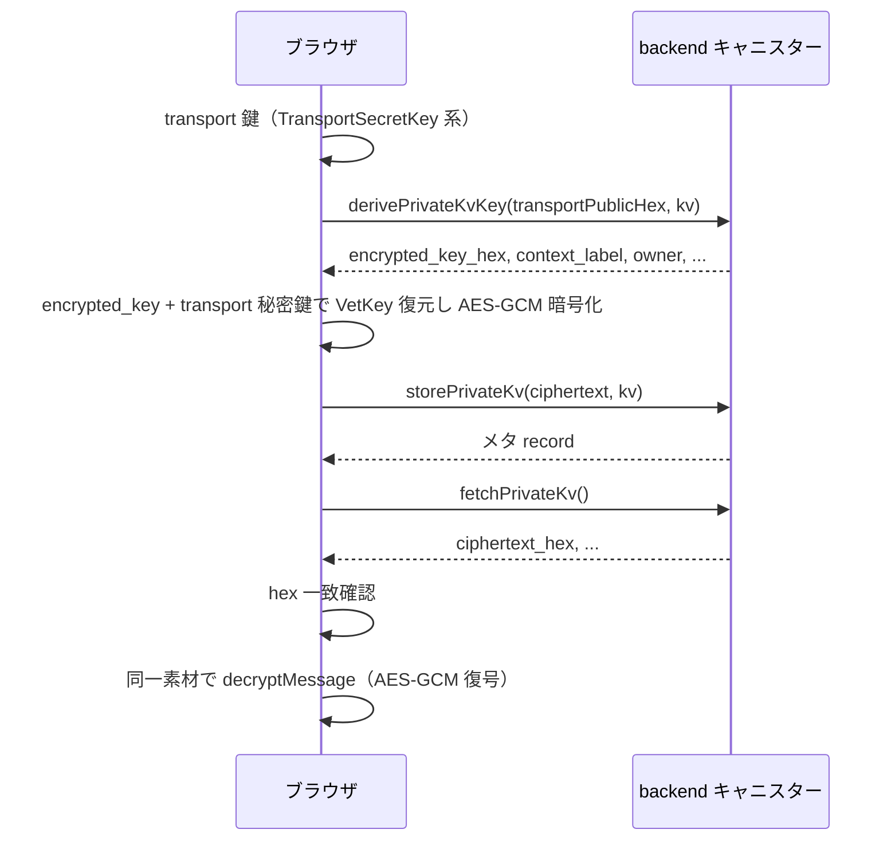

# vetKD 概要

vetKD は Management Canister の `vetkd_public_key` と `vetkd_derive_key` を使って、キャニスターごとの公開鍵生成と鍵導出を行う仕組みです。

## 要点

- `vetkd_public_key` は `opt principal` の `canister_id`、`context`、`key_id` を受け取り、`public_key` を返します。
- `vetkd_derive_key` は `input`、`context`、`transport_public_key`、`key_id` を受け取り、`encrypted_key` を返します。
- `vetkd_derive_key` には cycles の添付が必要です。
- ローカル開発では `test_key_1`、mainnet / testnet では `key_1` を使います。
- `context` はアプリケーションの domain separator として固定値を使うのが安全です。

---

## Private KV ラウンドトリップ（`PrivateKvRoundtrip.tsx` の流れ）

`examples/vetkey/frontend/app/src/components/PrivateKvRoundtrip.tsx` の `runRoundtrip`（おおよそ 58〜164 行）では、**caller（Internet Identity でログインしたプリンシパル）ごと**の Private KV に、vetKey 由来の素材で暗号化した平文を保存し、取り出して復号します。鍵生成と暗号化・復号はブラウザ上で行い、**サンプル backend キャニスター**には鍵導出結果の取得と blob の保存・取得だけを依頼します。

以下の **一例** は同じ実行の `console.log` に現れた値である。鍵・プリンシパル・暗号文は**実行ごとに変わる**。

### 事前条件（UI・入力）

- **key version**: 入力文字列を `BigInt` にし `kv` とする。`derivePrivateKvKey`・`storePrivateKv` の第 2 引数（`nat64`）に相当する値として渡る。  
  **一例**: UI で `1` → `kv` は `1n`。
- **平文**: `TextEncoder` で UTF-8 の `Uint8Array` にしてから、以降の暗号化処理に渡る。  
  **一例**: 文字列 `hello world` → バイト列の hex は `68656c6c6f20776f726c64`。

### ステップ 0: transport 鍵素材の生成（キャニスター呼び出しなし）

この段階では **キャニスターは呼ばない**。ブラウザ側のみで、以降のステップに渡す文字列・バイト列を用意する。

**0-1（ライブラリ `@dfinity/vetkeys`）** `TransportSecretKey.random()`

- **引数**: なし。
- **返り値**: transport 用の一時秘密鍵オブジェクト（以下 `transportSecret` と書く）。

**0-2（ライブラリ）** `transportSecret.serialize()`

- **引数**: なし。
- **返り値**: 秘密鍵の `Uint8Array`。

**0-3（アプリ）** バイト列を hex 文字列に変換

- **入力**: 0-2 のバイト列。
- **出力**: `transportSecretHex`（以降の復号までコンポーネントが保持。**キャニスターには送らない**）。  
  **一例**: `5783ba99bebd52ddc5b571f7b9a614f4eca22bb15d72158531c65028101f62bc`（32 バイト秘密鍵の hex）。

**0-4（ライブラリ）** `transportSecret.publicKeyBytes()`

- **引数**: なし。
- **返り値**: transport 公開鍵の `Uint8Array`。

**0-5（アプリ）** バイト列を hex 文字列に変換

- **入力**: 0-4 のバイト列。
- **出力**: `transportPublicHex`（**ステップ 1 のキャニスター第 1 引数**にだけ使う）。  
  **一例**: `8102bf18443192d520f865e10a2a3b604f4bd978ebba81476227771fec48eb16798ff5151cd3f0e0c753699f6d2057a6`（このログ例では `trim().toLowerCase()` の結果も同じ文字列）。

### ステップ 1: `derivePrivateKvKey`（キャニスター）

**Candid**: `derivePrivateKvKey : (text, nat64) -> (record { ... })`

**キャニスター呼び出し 1 回**

- **第 1 引数（`text`）**: ステップ 0-5 で得た `transportPublicHex`（transport 公開鍵の hex）。  
  **一例**: `8102bf18443192d520f865e10a2a3b604f4bd978ebba81476227771fec48eb16798ff5151cd3f0e0c753699f6d2057a6`。
- **第 2 引数（`nat64`）**: `kv`（key version）。  
  **一例**: `1n`。

**返り値（record）のうち、この往復で使う主なフィールド**

| フィールド | 意味 |
|------------|------|
| `owner` | KV の所有者プリンシパル（通常 caller） |
| `context_label` | 鍵導出に使った文脈のテキスト表現 |
| `encrypted_key_hex` | `vetkd_derive_key` の `encrypted_key` に相当する blob の hex。以降のブラウザ側処理の入力になる |

**一例（ログの `derive`）**

- `owner`: `oh6lq-ztqub-zlnpu-j77mj-43wln-6dthe-ctkdv-x37u7-bkous-a5rxy-hae`
- `context_label`: `private-kv-v1|owner=oh6lq-ztqub-zlnpu-j77mj-43wln-6dthe-ctkdv-x37u7-bkous-a5rxy-hae`
- `encrypted_key_hex`: 先頭 `ADAC5DEB3BD35CF015CAB21C69F56A475EBBBA453EF2B0B3D8` … 末尾 `BCBAEAD589228E9A676FF296D5E8E42FE090E63FD18E68D16`（コンソールでは中間が `…` で省略されることがある。全体は 192 バイト＝384 hex 文字程度）

コンポーネントでは、定数 `PRIVATE_KV_DOMAIN_SEP`（`"private-kv-v1"`）と `owner.toString()` から組み立てた文字列と **`context_label` が一致するか**を検証し、一致しなければ例外にする。

### ステップ 2: 平文の暗号化（キャニスター呼び出しなし）

この段階でも **キャニスターは呼ばない**。入力は、(a) ステップ 0-3 の `transportSecretHex`、(b) ステップ 1 の `encrypted_key_hex`、(c) 事前条件で用意した平文の `Uint8Array`、`(d)` ドメイン分離用の文字列（この例では `"private-kv-v1"`）である。

**一例（暗号化直前のログ）**: `transportSecretHex` は `5783ba99bebd52ddc5b571f7b9a614f4eca22bb15d72158531c65028101f62bc`、`plaintextHex` は `68656c6c6f20776f726c64`、`domainSep` は `private-kv-v1`。

**2-1（アプリ）** hex 文字列をバイト列に戻す

- **入力**: `transportSecretHex`。  
  **一例**: 上記 `5783ba99…01f62bc` の文字列全体。
- **出力**: 秘密鍵バイト列。

**2-2（ライブラリ `@dfinity/vetkeys`）** `TransportSecretKey.deserialize(...)`

- **引数**: 2-1 のバイト列。
- **返り値**: `transportSecret` と同等の秘密鍵オブジェクト。

**2-3（アプリ）** hex 文字列をバイト列に戻す

- **入力**: ステップ 1 の `encrypted_key_hex`。  
  **一例**: ステップ 1 で示した先頭・末尾を含む長い hex（全体で約 384 文字）。
- **出力**: `encrypted_key_bytes`（典型的には 192 バイト。先頭 48B・中間 96B・末尾 48B のレイアウト）。

**2-4（ライブラリ `@noble/curves`）** `bls12_381.G1.ProjectivePoint.fromHex`（2 回）

- **引数**: `encrypted_key_bytes` の先頭 48 バイト、および **末尾 48 バイト**（中間 96 バイトは読み飛ばす）。
- **返り値**: 曲線上の点 `c1` と `c3`。

**2-5（ライブラリ）** `transportSecret.serialize()` と `bls12_381.G1.normPrivateKeyToScalar(...)`

- **入力**: transport 秘密鍵のシリアルバイト列。
- **出力**: スカラー `sk`。

**2-6（ライブラリ `@noble/curves`）** 点の `multiply` / `subtract`

- **入力**: `c1`, `c3`, `sk`。
- **出力**: 点 `c3 - c1 * sk`（VetKey 用の点）。

**2-7（ライブラリ `@dfinity/vetkeys`）** `VetKey` の構築

- **引数**: 2-6 の点。
- **返り値**: `VetKey` インスタンス。

**2-8（ライブラリ `@dfinity/vetkeys`）** `asDerivedKeyMaterial()`（`await`）

- **引数**: なし（レシーバは 2-7 の `VetKey`）。
- **返り値**: VetKey の生バイト列を IKM として Web Crypto の HKDF に載せられるオブジェクト。

**2-9（ライブラリ `@dfinity/vetkeys` + Web Crypto）** `encryptMessage(plaintext, domainSep)`

- **引数**: 平文の `Uint8Array`、ドメイン分離文字列 `domainSep`（この例では `"private-kv-v1"`）。`domainSep` の UTF-8 は **HKDF の `info`** として使われ、**AES-GCM の AAD ではない**（`@dfinity/vetkeys` 0.4.x 系の実装に準拠）。
- **返り値**: **`IV（12 バイト）‖ AES-256-GCM の ciphertext と認証タグ`** からなる単一の `Uint8Array`。  
  **一例**: 長さ 39 の `Uint8Array`、hex は `7483d5c00c2807b487af8525f3a40ea57326dbe957829dd1bd2a92b2573eaaf5554a395d4582e6`（12 + 11 + 16 バイト）。

**2-10（アプリ）** 暗号文バイト列を hex 文字列に変換

- **入力**: 2-9 の `Uint8Array`。  
  **一例**: 上記と同じ `7483d5c0…582e6`。
- **出力**: 以降の表示・比較用の hex（`storePrivateKv` には **バイト列のまま**渡す）。

### ステップ 3: `storePrivateKv`（キャニスター）

**Candid**: `storePrivateKv : (blob, nat64) -> (record { ... })`

**キャニスター呼び出し 1 回**

- **第 1 引数（`blob`）**: ステップ 2-9 で得た暗号文バイト列。  
  **一例**: ステップ 2-9 の 39 バイトと同じ内容の `Uint8Array`。
- **第 2 引数（`nat64`）**: `kv`。  
  **一例**: `1n`。

**返り値**: メタ情報の record（この最小往復では主に「保存が通った」ことの確認に留まる）。

### ステップ 4: `fetchPrivateKv`（キャニスター）

**Candid**: `fetchPrivateKv : () -> (record { ciphertext_hex: text; key_version: nat; owner: principal; })`

**キャニスター呼び出し 1 回**

- **引数**: なし（caller の KV を読む）。

**返り値**

- **`ciphertext_hex`**: 保存されていた暗号文の hex 文字列。  
  **一例**: `7483D5C00C2807B487AF8525F3A40EA57326DBE957829DD1BD2A92B2573EAAF5554A395D4582E6`（大文字混在で返る例）。
- その他 `key_version`, `owner`。

コンポーネントでは、フェッチした hex を小文字に正規化したものと、ステップ 2-10 で得た hex の小文字化とを比較し、一致しなければ例外にする。  
**一例**: `fetchedCiphertextHexLower` は `7483d5c00c2807b487af8525f3a40ea57326dbe957829dd1bd2a92b2573eaaf5554a395d4582e6` で、ステップ 2-10 の hex（小文字）と一致する。

### ステップ 5: 復号（キャニスター呼び出しなし）

**キャニスターは呼ばない**。入力は、(a) ステップ 0-3 の `transportSecretHex`、(b) ステップ 1 の `encrypted_key_hex`、(c) ステップ 4 の `ciphertext_hex` をバイト列に戻したもの、(d) ステップ 2 と同じ `domainSep` である。

**一例**: `transportSecretHex` は `5783ba99…01f62bc`、`ciphertext_hex` はステップ 4 の大文字 hex をバイト列に戻したもの、`domainSep` は `private-kv-v1`。

**5-1 〜 5-8**  
ステップ **2-1 〜 2-8** と同じ順で、同じ `transportSecretHex` と `encrypted_key_hex` から、ステップ 2-8 と同種のオブジェクト（HKDF 用 IKM を内包）まで到達する。

**5-9（ライブラリ `@dfinity/vetkeys` + Web Crypto）** `decryptMessage(ciphertext, domainSep)`

- **引数**: ステップ 4 で得た暗号文バイト列（先頭 12 バイトを IV、残りを GCM の本体＋タグとして解釈）、`domainSep`。
- **返り値**: 平文の `Uint8Array`。  
  **一例（ログ）**: `decryptedBytesHex` は `68656c6c6f20776f726c64`（暗号化前の `plaintextHex` と一致）、長さ 11 バイト。

**5-10（ブラウザ標準）** `TextDecoder`

- **入力**: 5-9 のバイト列。
- **出力**: UTF-8 文字列。コンポーネントはこれを入力平文と比較する。  
  **一例（ログ）**: `decryptedBytesUtf8` は `hello world`。

### 対称暗号の要点（ライブラリ内の `encryptMessage` / `decryptMessage`）

| 項目 | 内容 |
|------|------|
| IKM | VetKey の生バイト列（BLS 上の表現の 48 バイトに相当） |
| 鍵導出 | HKDF（SHA-256）、salt 空、`info` = `domainSep` の UTF-8、AES-256-GCM 256 bit |
| 形式 | 暗号文は **12 バイト IV + GCM 出力（タグ含む）** |

### 処理の流れ（要約図）

## 参考

- [Management Canister / vetKD](https://docs.internetcomputer.org/references/management-canister#vetkd-verifiable-encrypted-threshold-key-derivation)
- [@dfinity/vetkeys（npm）](https://www.npmjs.com/package/@dfinity/vetkeys)
